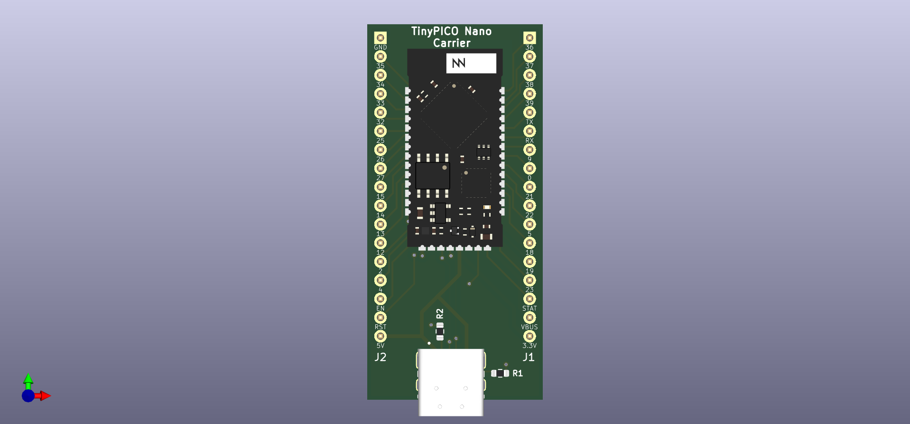

# tinypico-nano-carrier

A carrier/breakout board for the TinyPICO Nano.

## Schematic

## Render

## Bill of Materials

- 1x TinyPICO Nano
- 2x 17-pin 0.1" headers
- 1x GCT USB4085-GF-A
- 2x 5.1k Ohm 1608 Resistors
